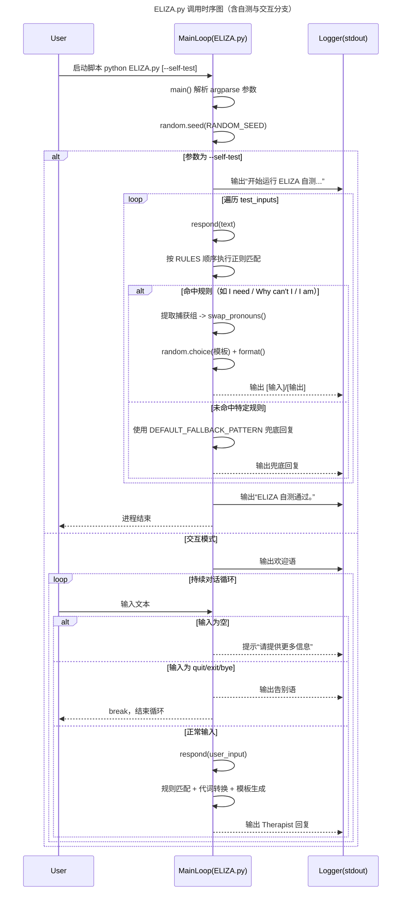

# ELIZA.py 调用时序图

## 场景说明
- 目标模块：`ELIZA.py`
- 场景覆盖：启动初始化、参数分支（自测/交互）、规则匹配、兜底回复、退出流程
- 参与者（按需）：`User`、`MainLoop`、`Logger`

## 分支说明
- `alt` 自测模式：执行内置样例并输出结果后结束
- `else` 交互模式：循环读取输入，按退出/空输入/正常输入分别处理
- 规则匹配分支：命中特定正则时生成模板回复；否则走通配符兜底

## 维护建议
- 若新增规则模式，需同步更新“规则匹配分支”中的说明与 Mermaid 片段。
- 若新增配置加载、外部 API 或日志组件，建议补充对应参与者与异常分支。
